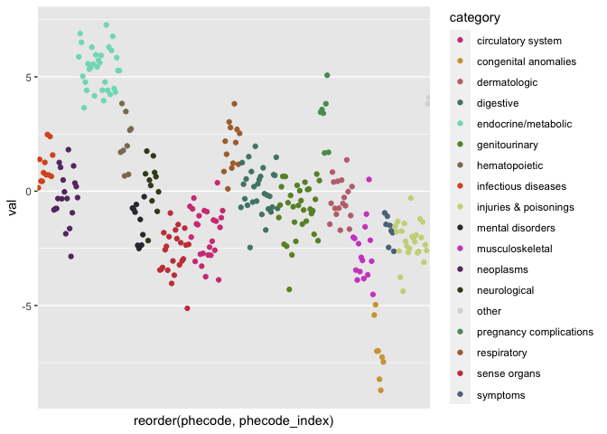
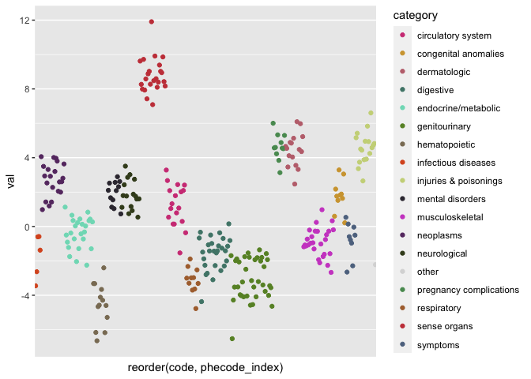
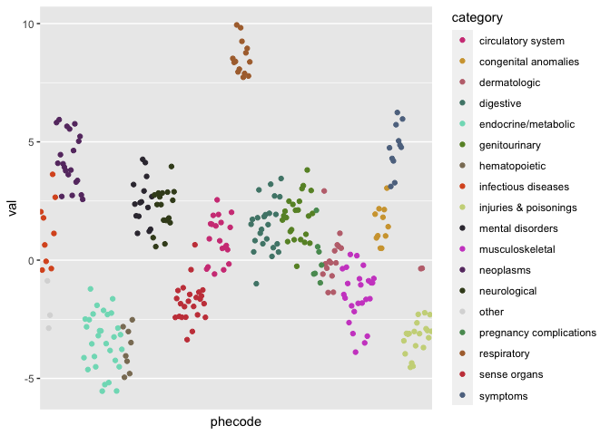

<!-- README.md is generated from README.Rmd. Please edit that file -->

# phewasHelper

<!-- badges: start -->

<!-- badges: end -->

The goal of phewasHelper is to provide a set of simple lightweight
helper functions for working with Phecode and Phewas data.

## Installation

And the development version from [GitHub](https://github.com/) with:

``` r
# install.packages("devtools")
devtools::install_github("nstrayer/phewas_helper")
```

## Usage

We will use a sample set of simulated PheWas data with phecodes to
demonstrate the functions.

``` r
library(phewasHelper)

head(phewas_data)
#> # A tibble: 6 x 2
#>    code    val
#>   <dbl>  <dbl>
#> 1  696. -5.59 
#> 2  364.  4.56 
#> 3  287   1.05 
#> 4  428  -1.49 
#> 5  990   0.173
#> 6  327.  0.781
```

### Normalizing phecodes

Phecodes show up in about a million different formats. In our demo data
the phecodes have been converted to a numeric value. This would be an
issue if we tried to harmonize with data that stored the phecodes in a
string. The function `normalize_phecodes` is designed to fix this
problem. It takes any phecode array and coerces it to a standard
zero-padded string.

``` r
phewas_data %>% 
  mutate(fixed_code = normalize_phecode(code)) %>% 
  head()
#> # A tibble: 6 x 3
#>    code    val fixed_code
#>   <dbl>  <dbl> <chr>     
#> 1  696. -5.59  696.40    
#> 2  364.  4.56  364.10    
#> 3  287   1.05  287.00    
#> 4  428  -1.49  428.00    
#> 5  990   0.173 990.00    
#> 6  327.  0.781 327.31

# Update our original data with normalized phecodes
phewas_data <- phewas_data %>% 
  mutate(code = normalize_phecode(code))
```

### Getting phecode information

Another issue that is commonly encountered in PheWas results is wanting
to know what exactly a code is. The functions `get_phecode_info()` and
`join_phecode_info()` help with that.

`get_phecode_info()` is the simpler of the two. It takes as input an
array of phecodes and returns an array of the desired information,
either description or category. This is useful for adding individual
columns to a dataframe.

``` r
phewas_data %>% 
  mutate(descript = get_phecode_info(code, 'description'),
         category = get_phecode_info(code, 'category')) %>% 
  head()
#> # A tibble: 6 x 4
#>   code      val descript                                  category             
#>   <chr>   <dbl> <chr>                                     <chr>                
#> 1 696.40 -5.59  Psoriasis                                 dermatologic         
#> 2 364.10  4.56  Corneal opacity                           sense organs         
#> 3 287.00  1.05  Purpura and other hemorrhagic conditions  hematopoietic        
#> 4 428.00 -1.49  Congestive heart failure; nonhypertensive circulatory system   
#> 5 990.00  0.173 Effects radiation NOS                     injuries & poisonings
#> 6 327.31  0.781 Central/nonobstroctive sleep apnea        neurological
```

For more a more complete labeling of phecode information the function
`join_phecode_info()` modifies a passsed dataframe by appending a
desired subset of description, category, category number, and phecode
index columns.

``` r
# We can append all info available
phewas_data %>% 
  join_phecode_info(phecode_column = 'code') %>% 
  head()
#> # A tibble: 6 x 6
#>   phecode    val description           category    category_number phecode_index
#>   <chr>    <dbl> <chr>                 <chr>                 <dbl>         <int>
#> 1 696.40  -5.59  Psoriasis             dermatolog…              13          1431
#> 2 364.10   4.56  Corneal opacity       sense orga…               7           630
#> 3 287.00   1.05  Purpura and other he… hematopoie…               4           423
#> 4 428.00  -1.49  Congestive heart fai… circulator…               8           814
#> 5 990.00   0.173 Effects radiation NOS injuries &…              18          1843
#> 6 327.31   0.781 Central/nonobstrocti… neurologic…               6           528


# Or we can just extract what we need
phewas_data <- phewas_data %>% 
  join_phecode_info(phecode_column = 'code',
                    cols_to_join = c("description", "category", "phecode_index"))

head(phewas_data)
#> # A tibble: 6 x 5
#>   phecode    val description                      category         phecode_index
#>   <chr>    <dbl> <chr>                            <chr>                    <int>
#> 1 696.40  -5.59  Psoriasis                        dermatologic              1431
#> 2 364.10   4.56  Corneal opacity                  sense organs               630
#> 3 287.00   1.05  Purpura and other hemorrhagic c… hematopoietic              423
#> 4 428.00  -1.49  Congestive heart failure; nonhy… circulatory sys…           814
#> 5 990.00   0.173 Effects radiation NOS            injuries & pois…          1843
#> 6 327.31   0.781 Central/nonobstroctive sleep ap… neurological               528
```

### Coloring PheWas plots

Manhattan plots are commonly made of phewas results. Frequently the
colors of the plots points are encoded by the categories. The default
color palletes in ggplot2 and base-plot are not great and custom
palletes like R color-brewer don’t give you enough colors to work with
all the categories. To deal with this `category_colors()` returns a
mapping of phecode category to colors that can be used easily in your
plots.

``` r
library(ggplot2)

phewas_data %>% 
  ggplot(aes(x = reorder(phecode, phecode_index), y = val, color = category)) +
  geom_point() +
  scale_color_manual(values = category_colors()) +
  theme(axis.ticks.x = element_blank(),
        axis.text.x = element_blank(),
        panel.grid.major.x = element_blank(),
        panel.grid.minor.x = element_blank())
```



If just the color pallete is needed for `ggplot` then the function
`scale_color_phecode()` makes this even easier.

``` r
phewas_data %>% 
  ggplot(aes(x = reorder(phecode, phecode_index), y = val, color = category)) +
  geom_point() +
  scale_color_phecode() +
  theme(axis.ticks.x = element_blank(),
        axis.text.x = element_blank(),
        panel.grid.major.x = element_blank(),
        panel.grid.minor.x = element_blank())
```


### ggplot theme

One last helper is a theme object that lets you get rid of the tick
marks for each phecode without the laboreous typing of
`theme(axis.ticks.x = ...)` repeatedly.

``` r
phewas_data %>% 
  ggplot(aes(x = reorder(phecode, phecode_index), y = val, color = category)) +
  geom_point() +
  scale_color_manual(values = category_colors()) +
  theme_phewas()
```



It can also be used on phecode-on-y-axis plots.

``` r
phewas_data %>% 
  ggplot(aes(y = reorder(phecode, phecode_index), x = val, color = category)) +
  geom_point() +
  scale_color_manual(values = category_colors()) +
  theme_phewas(phecode_on_x_axis = FALSE)
```


