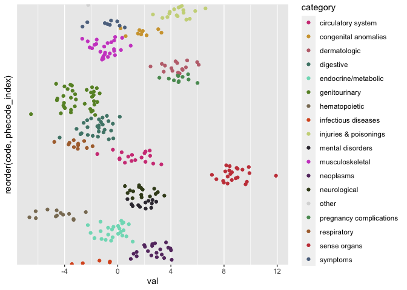

<!-- README.md is generated from README.Rmd. Please edit that file -->

# phewasHelper

<!-- badges: start -->

<!-- badges: end -->

The goal of phewasHelper is to provide a set of simple lightweight
helper functions for working with Phecode and Phewas data.

## Installation

And the development version from [GitHub](https://github.com/) with:

``` r
# install.packages("devtools")
devtools::install_github("nstrayer/phewas_helper")
```

## Usage

We will use a sample set of simulated PheWas data with phecodes to
demonstrate the functions.

``` r
library(phewasHelper)

head(phewas_data)
#> # A tibble: 6 x 2
#>    code   val
#>   <dbl> <dbl>
#> 1  324  -5.85
#> 2  389. -4.01
#> 3  458. -2.89
#> 4  245. -1.47
#> 5  747. -2.81
#> 6  562  -1.48
```

### Normalizing phecodes

Phecodes show up in about a million different formats. In our demo data
the phecodes have been converted to a numeric value. This would be an
issue if we tried to harmonize with data that stored the phecodes in a
string. The function `normalize_phecodes` is designed to fix this
problem. It takes any phecode array and coerces it to a standard
zero-padded string.

``` r
phewas_data %>% 
  mutate(fixed_code = normalize_phecode(code)) %>% 
  head()
#> # A tibble: 6 x 3
#>    code   val fixed_code
#>   <dbl> <dbl> <chr>     
#> 1  324  -5.85 324.00    
#> 2  389. -4.01 389.20    
#> 3  458. -2.89 458.20    
#> 4  245. -1.47 245.10    
#> 5  747. -2.81 747.10    
#> 6  562  -1.48 562.00


# Update our original data with normalized phecodes
phewas_data <- phewas_data %>% 
  mutate(code = normalize_phecode(code))
```

### Getting phecode information

Another issue that is commonly encountered in PheWas results is wanting
to know what exactly a code is. The functions `get_phecode_info()` and
`join_phecode_info()` help with that.

`get_phecode_info()` is the simpler of the two. It takes as input an
array of phecodes and returns an array of the desired information,
either description or category. This is useful for adding individual
columns to a dataframe.

``` r
phewas_data %>% 
  mutate(descript = get_phecode_info(code, 'description'),
         category = get_phecode_info(code, 'category')) %>% 
  head()
#> # A tibble: 6 x 4
#>   code     val descript                              category            
#>   <chr>  <dbl> <chr>                                 <chr>               
#> 1 324.00 -5.85 Other CNS infection and poliomyelitis neurological        
#> 2 389.20 -4.01 Conductive hearing loss               sense organs        
#> 3 458.20 -2.89 Iatrogenic hypotension                circulatory system  
#> 4 245.10 -1.47 Thyroiditis, acute and subacute       endocrine/metabolic 
#> 5 747.10 -2.81 Cardiac congenital anomalies          congenital anomalies
#> 6 562.00 -1.48 Diverticulosis and diverticulitis     digestive
```

For more a more complete labeling of phecode information the function
`join_phecode_info()` modifies a passsed dataframe by appending
description, category, and category number columns.

``` r
phewas_data <- phewas_data %>% 
  join_phecode_info(phecode_column = 'code')

head(phewas_data)
#> # A tibble: 6 x 5
#>   phecode   val description                     category         category_number
#>   <chr>   <dbl> <chr>                           <chr>                      <int>
#> 1 324.00  -5.85 Other CNS infection and poliom… neurological                   6
#> 2 389.20  -4.01 Conductive hearing loss         sense organs                   7
#> 3 458.20  -2.89 Iatrogenic hypotension          circulatory sys…               8
#> 4 245.10  -1.47 Thyroiditis, acute and subacute endocrine/metab…               3
#> 5 747.10  -2.81 Cardiac congenital anomalies    congenital anom…              15
#> 6 562.00  -1.48 Diverticulosis and diverticuli… digestive                     10
```

### Coloring PheWas plots

Manhattan plots are commonly made of phewas results. Frequently the
colors of the plots points are encoded by the categories. The default
color palletes in ggplot2 and base-plot are not great and custom
palletes like R color-brewer don’t give you enough colors to work with
all the categories. To deal with this `category_colors()` returns a
mapping of phecode category to colors that can be used easily in your
plots.

``` r
library(ggplot2)

phewas_data %>% 
  ggplot(aes(x = phecode, y = val, color = category)) +
  geom_point() +
  scale_color_manual(values = category_colors()) +
  theme(axis.ticks.x = element_blank(),
        axis.text.x = element_blank(),
        panel.grid.major.x = element_blank(),
        panel.grid.minor.x = element_blank())
```



If just the color pallete is needed for `ggplot` then the function
`scale_color_phecode()` makes this even easier.

``` r
phewas_data %>% 
  ggplot(aes(x = phecode, y = val, color = category)) +
  geom_point() +
  scale_color_phecode() +
  theme(axis.ticks.x = element_blank(),
        axis.text.x = element_blank(),
        panel.grid.major.x = element_blank(),
        panel.grid.minor.x = element_blank())
```


